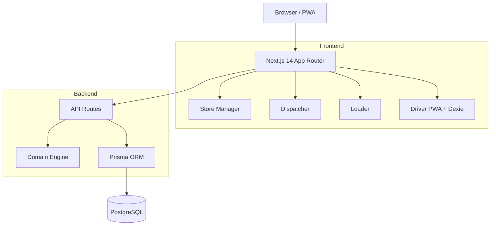

# Architecture

```mermaid
graph TD
    Client[Browser / PWA] --> NextJS[Next.js 14 App Router]
    
    subgraph Frontend
        NextJS --> StoreManagerUI[Store Manager]
        NextJS --> DispatcherUI[Dispatcher]
        NextJS --> LoaderUI[Loader]
        NextJS --> DriverUI[Driver PWA + Dexie]
    end
    
    subgraph Backend
        NextJS --> APIRoutes[API Routes]
        APIRoutes --> Engine[Domain Engine]
        APIRoutes --> Prisma[Prisma ORM]
    end
    
    Prisma --> DB[(PostgreSQL)]
```
