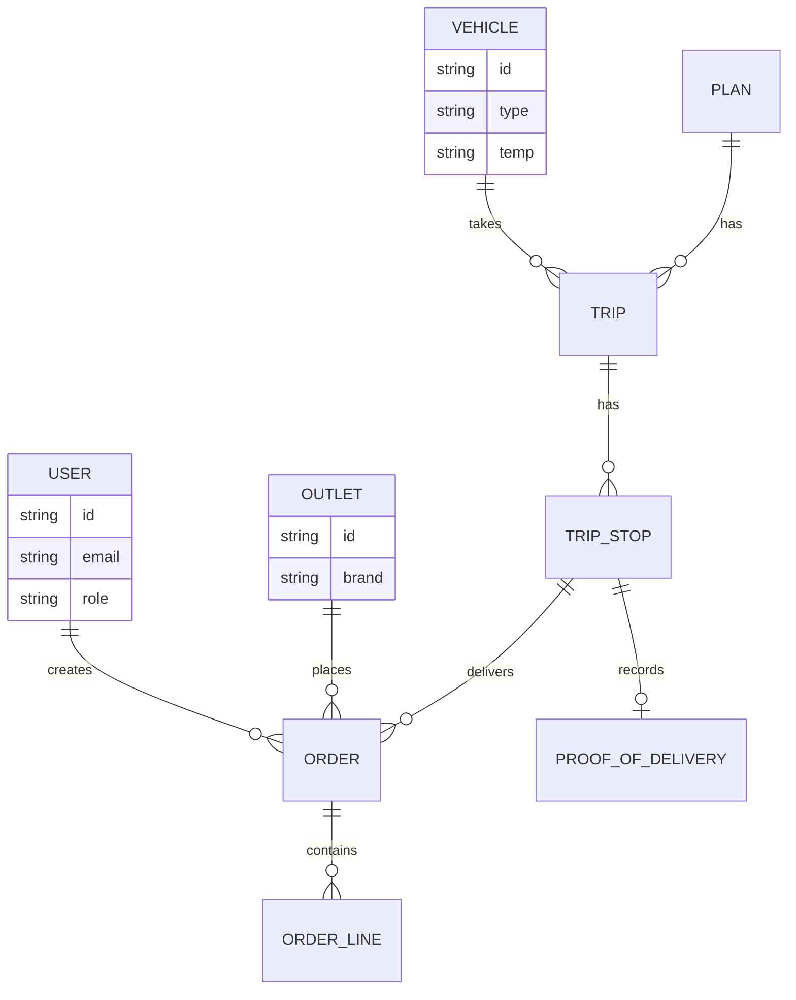

# Data Model

```mermaid
erDiagram
    USER ||--o{ ORDER : creates
    USER {
        string id
        string email
        string role
    }
    OUTLET ||--o{ ORDER : places
    OUTLET {
        string id
        string brand
    }
    VEHICLE ||--o{ TRIP : takes
    VEHICLE {
        string id
        string type
        string temp
    }
    PLAN ||--o{ TRIP : has
    TRIP ||--o{ TRIP_STOP : has
    TRIP_STOP ||--o| PROOF_OF_DELIVERY : records
    ORDER ||--o{ ORDER_LINE : contains
    TRIP_STOP ||--o{ ORDER : delivers
```
